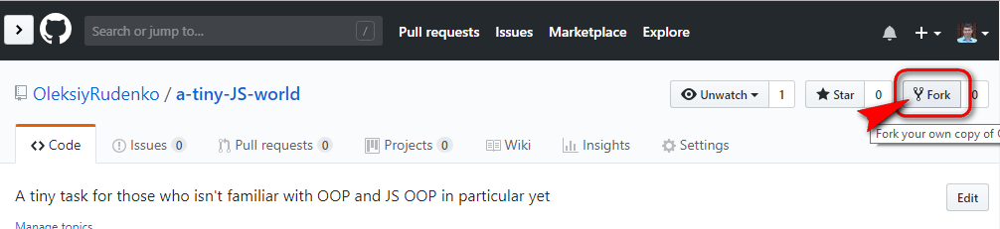
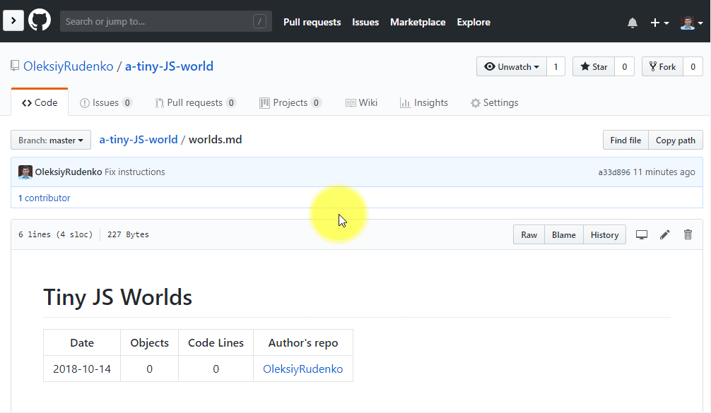
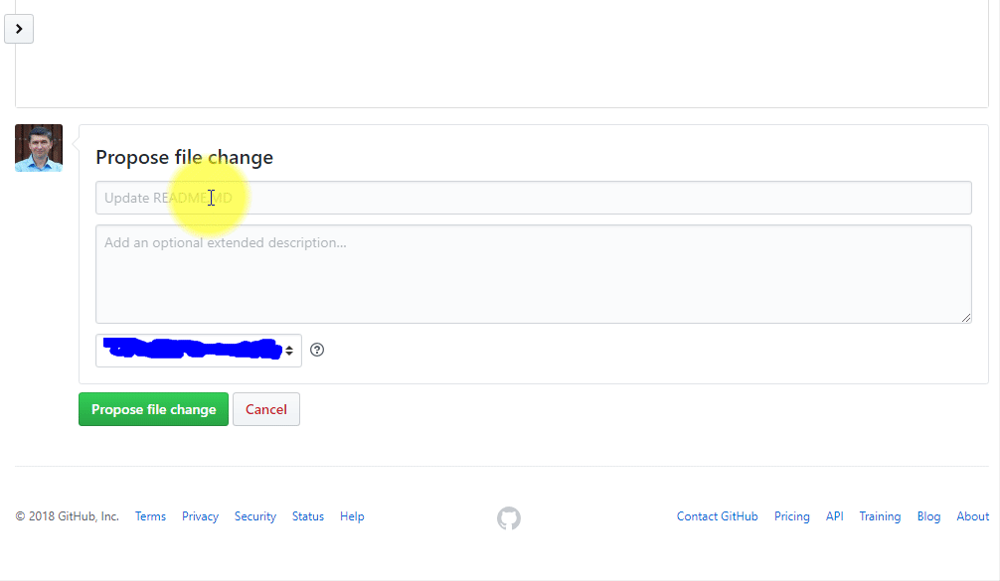

[![MIT Licensed][icon-mit]][license]
[![Kottans-Frontend][icon-kottans]][kottans-frontend]

# A Tiny JS World

This is a tiny task for those who are not familiar with
Object-Oriented Programing concepts yet.
And with JavaScript OOP in particular.

## Table of Contents

<!-- START doctoc generated TOC please keep comment here to allow auto update -->
<!-- DON'T EDIT THIS SECTION, INSTEAD RE-RUN doctoc TO UPDATE -->


- [About you](#about-you)
- [The story](#the-story)
- [First approach](#first-approach)
  - [Preparations](#preparations)
  - [The job](#the-job)
  - [Keep things simple](#keep-things-simple)
  - [Testing your app](#testing-your-app)
  - [Publishing](#publishing)
- [What's next](#whats-next)
  - [List your repo](#list-your-repo)
  - [Code review](#code-review)
- [Leveling your skills up](#leveling-your-skills-up)
- [Credits](#credits)

<!-- END doctoc generated TOC please keep comment here to allow auto update -->
<!-- generated with [DocToc](https://github.com/thlorenz/doctoc) -->

## About you

This place can be useful to you if you

* know JavaScript basics
* don't know any OOP or at least JavaScript specific OOP

## The story

There is a tiny world inhabited by a dog, a cat, a woman,
a man, and sometimes by a cat-woman.

You will be creating a JavaScript model of this world.

## First approach

### Preparations

1. Fork [this repo](https://github.com/OleksiyRudenko/a-tiny-JS-world)

   

1. Clone your fork locally

1. `index.js` is what you will work with. Put your code
   into it. 
   It is also a good practice to work in a dedicated
   branch, not `master`. So start with `checkout -B populate-world`
   before committing any changes.

### The job

 1. Define objects representing this world inhabitants:
    a dog, a cat, a woman, and a man.
    - Each inhabitant has hands (optional, naturally), legs,
      a name, is of certain gender, and also can say
      something relevant, like "meow" or "Hello Jenny!".
 1. List inhabitants using project built-in `print(message)` function.
    Each list entry should look like
    `human; John; male; 2; 2; Hello world!`
    - if inhabitant has no hands then
      skip it or report `0` or `undefined`, it is totally up to you
 1. Optional: each inhabitant can be friendly to 1 or
    more other inhabitants (or to none). If you implement
    this then the output should also list friends, i.e.
    `human; John; male; 2; 2; Hello world!; Rex, Tom, Jenny`
 1. Optional: Define an object representing cat-woman.
    - cat-woman's saying should be exactly the same as
      cat's
    - whenever you change cat's saying cat-woman's saying
      should change accordingly, they are strongly tied
      on some astral level

Read following [Keep things simple](#keep-things-simple)
and [Testing your app](#testing-your-app) sections
before you start coding.

### Keep things simple

**NB!** At this stage you don't need anything beyond what you
already know. Do not study any OOP.
Anything like example below would work.

```javascript
const dog = {
  species: 'dog',
  name: 'Toby',
  gender: 'male',
  legs: 4,
  hands: 0,
  saying: 'woof-woof!'
};
// ... other objects ...
print(dog.species + ';' + dog.name + ';' + dog.gender + ';' + 
  dog.legs + ';' + dog.hands + ';' + dog.saying);
// ... other print-outs ...
```

If you know how to improve the code sample above e.g. employing
[`#Array.join`](https://developer.mozilla.org/en-US/docs/Web/JavaScript/Reference/Global_Objects/Array/join)
or a function that takes an object as an argument
and returns a string to feed to `print()` then go ahead.

You will have the opportunity to improve your skills later on
and your current solution at your current level of knowledge
will become a milestone to measure your improvement against.
That is the aim of incremental studying process:
**Do - Learn - Improve**

### Testing your app

To see how things work open `index.html` in Live Server mode in your IDE.

> How to open file in the LiveServer mode:
> - [VS Code](https://github.com/ritwickdey/vscode-live-server)
> - [WebStorm](./img/WebStorm-LiveServer.png)

Press `Ctrl-Shift-J` in Google Chrome or Mozilla Firefox to see
developer's console for possible errors.

You may want to prettify the output, but try focusing more on code itself.

Doing `var object1 = object2` and `object2.name='Anny'`
results in changing name of `object1` to `Anny` as well?

Read about
[Copying Objects in JavaScript](https://scotch.io/bar-talk/copying-objects-in-javascript)

Once you are happy with your app, or at least it doesn't report any errors in dev console
you may consider it to be of release quality and worth merging into master:

`git checkout master && git merge populate-world`

However, proceed with any further changes when on `populate-world` or
another feature branch, merging into `master` from time to time.

### Publishing

Push your repo to github.

You may want to publish your world on [GitHub Pages](https://pages.github.com/).
Following the [official GitHub guidelines](https://docs.github.com/en/pages/getting-started-with-github-pages/configuring-a-publishing-source-for-your-github-pages-site)
on a simple web-project publishing.

Now your world is published at
`https://<YourGithubUsername>.github.io/a-tiny-JS-world/`

Publication will be automatically updated when you push your new commits
(although it may take 5 to 10 minutes since `git push`).

[_^ Up to TOC ^_](#table-of-contents)

## What's next

You're done? Congratulations!

Did you like the experience?
Grant this repo a :star:!

### List your repo

1. Navigate to [A Tiny JS World root repo worlds list](https://github.com/OleksiyRudenko/a-tiny-JS-world/blob/master/worlds.md)

1. Edit the file
   * Click **Edit this file** button

   * Copy the very first line in the table, go all way down
     to the end of the table, insert the copy as
     the last row in the table, and edit it as
     appropriate specifying:
     - current date as YYYY-MM-DD
     - number of objects you created
     - number of code lines your object definitions take
     - your GitHub nick in square brackets
       and link to your repository in parentheses
       
   * Add an extra new line so additions from other contributors
     do not affect yours.

   * Switch to Preview tab to check if the table still looks
     nice.

   

1. Submit changes
   * Scroll down to **Propose file change**
   * Type "List a tiny JS world by <your name>" in commit subject
   * Click **Propose file change** button, then **Create pull request** and then **Create pull request** once again to complete.

   

You are done here!

_Please, note that PRs may not be merged very soon. Thank you
for your patience._

### Code review

If you have completed this task as a part
of [Kottans Front-End Course](https://github.com/kottans/frontend)
ask a course mentor or classmates to support you.
Check this task intro within the course for instructions.

Otherwise, ask someone to review your code and come up with
explanations on how it could be completed with OOP
in mind. It is always good to explain yet another
approach on some working code.

Keep in mind that this was just a tiny world and
whenever you need to build bigger worlds
Object-Oriented Programming concepts come
to your rescue.

[_^ Up to TOC ^_](#table-of-contents)

## Leveling your skills up

### Learn on your own

Imagine you have to build a big world populated with billions
of inhabitants and a great variety of species, and your world
project code base will be distributed across many files.

Now, here are the problems.

 - How do you create many similar objects?
 - How do you add an attribute to all e.g. humans?
 - How do you access your world inhabitants across your code base?
 - How do you deal with common attributes for multiple species?
 - How do you aggregate inhabitants into communities (families,
   countries etc.)?
 - What if you decide to add a family name and want that a person
   being asked for her or his name would include family name
   in their response? (And you already have these questions
   posed in multiple locations across your code base)

**In other words how do you make your code scalable?**

Object-Oriented Programing (OOP) concepts come to your rescue.

The following will help you to make yourself familiar
with OOP and JavaScript OOP.

- [How to explain object-oriented programming concepts to a 6-year-old](https://medium.freecodecamp.org/object-oriented-programming-concepts-21bb035f7260)
- [Object-oriented JavaScript for beginners](https://developer.mozilla.org/en-US/docs/Learn/JavaScript/Objects/Object-oriented_JS)
- [Object oriented programming in javascript](https://www.sohamkamani.com/blog/2016/04/30/oops-in-js/)
- [A guide to prototype-based class inheritance in JavaScript](https://levelup.gitconnected.com/a-guide-to-prototype-based-class-inheritance-in-javascript-e2e30c2c92b4)
- [Fundamental Object Design Patterns](https://medium.com/launch-school/javascript-weekly-fundamental-object-design-patterns-31453f68427f)
- [Composition over Inheritance
](https://medium.com/humans-create-software/composition-over-inheritance-cb6f88070205)
- MDN reference:
  * [constructor](https://developer.mozilla.org/en-US/docs/Web/JavaScript/Reference/Classes/constructor)
  * [extends](https://developer.mozilla.org/en-US/docs/Web/JavaScript/Reference/Classes/extends)
  * [super](https://developer.mozilla.org/en-US/docs/Web/JavaScript/Reference/Operators/super)
- [“Super” and “Extends” In JavaScript ES6 - Understanding The Tough Parts](https://medium.com/beginners-guide-to-mobile-web-development/super-and-extends-in-javascript-es6-understanding-the-tough-parts-6120372d3420) - How ES6 class syntax maps onto ES5 prototype features. 
- [What is `super()` in Javascript](https://css-tricks.com/what-is-super-in-javascript/)
- [ES6 classes cheat snippet](https://gist.github.com/OleksiyRudenko/672d39b08d9d0da4e179aca49876c58b)

Consider completing
[Object-Oriented Javascript](https://github.com/kottans/frontend/blob/master/tasks/js-oop.md)
from [Kottans Front-End Course](https://github.com/kottans/frontend) if not yet.

Some extras related to OOP:
 - [DRY, KISS, YAGNI](https://code.tutsplus.com/tutorials/3-key-software-principles-you-must-understand--net-25161)
 - [SOLID](https://medium.com/@cramirez92/s-o-l-i-d-the-first-5-priciples-of-object-oriented-design-with-javascript-790f6ac9b9fa)

### Improve your code

If you feel now that you can improve your code being armed
with OOP knowledge then go ahead!

In addition to the [requirements above](#the-job) implement the following:
1. we need **at least** three men, three women, two cats and two dogs;
   all cats produce the same word when they meow, all dogs produce the same word as a bark;
   write the code in a manner that adding more inhabitants
   by a peer developer will require as small effort as only possible,
   so you will need to keep the code DRY;
1. at inhabitant creation time some properties are assigned a default value,  
   so that  we do not need to specify species at inhabitant creation time;
   same goes with legs, hands, and whatever words we define for animals to say;
   although any properties
   with default values should exist and be initialized;
1. if any inhabitant doesn't have a property by natural design (e.g. dogs do not have hands),
   then the class shouldn't have its own or inherited property;
   no hands - no property and no info about hands in presentation string and so on;
1. (optional, yet may be requested by a reviewer) all inhabitants
   have friends from among other inhabitants;
   friends list should store inhabitants (not just names as strings),
   while output lists only friends' names;
   what to print if an inhabitant has no friends? you decide;
1. (optional): change all cat's word for meow, CatWoman's word
   should also change accordingly without additional effort;
   add code fragment that clearly demonstrates this effect.

When done **update your row**
in the [worlds.md](https://github.com/OleksiyRudenko/a-tiny-JS-world/blob/master/worlds.md)
submitting a relevant PR.

### Wrap-up

Grats! You've done a great job! You have improved your OOP skills and
hopefully feel happier and self-confident.

Your repo fork reflects your progress, so feel free exposing it
to whoever might be interested in your learning path proofs.

[_^ Up to TOC ^_](#table-of-contents)

## Credits

This repo is dedicated to my elder son Yaroslav who turned
18 on this repo creation date.

This Tiny JS World project wouldn't ever happen without
[Kottans](http://kottans.org/) and awesome
[Kottans Front-End Course](https://github.com/kottans/frontend)
(it's free and initial part is completely remote)
I have completed as a student in 2017 and since then
have a chance to contribute thus paying back.

Special thanks to [Anastasiya Mashoshyna](https://github.com/AMashoshyna),
[Yevhen Orlov](https://github.com/yevhenorlov) and other
[Kottans](https://github.com/kottans) for the discussion, feedback,
and support that resulted in this project creation.

[_^ Up to TOC ^_](#table-of-contents)

[icon-mit]: https://img.shields.io/badge/license-MIT-blue.svg
[license]: https://github.com/OleksiyRudenko/a-tiny-JS-world/blob/master/LICENSE.md

[icon-kottans]: https://img.shields.io/badge/%3D(%5E.%5E)%3D-frontend-yellow.svg
[kottans-frontend]: https://github.com/kottans/frontend
